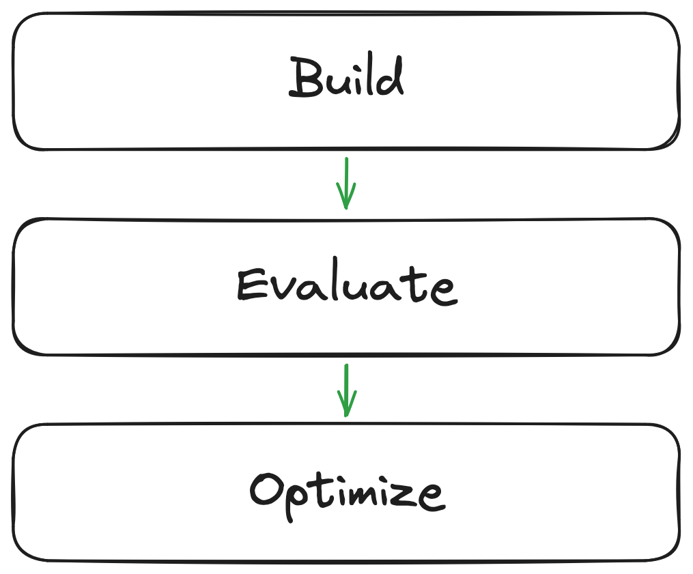
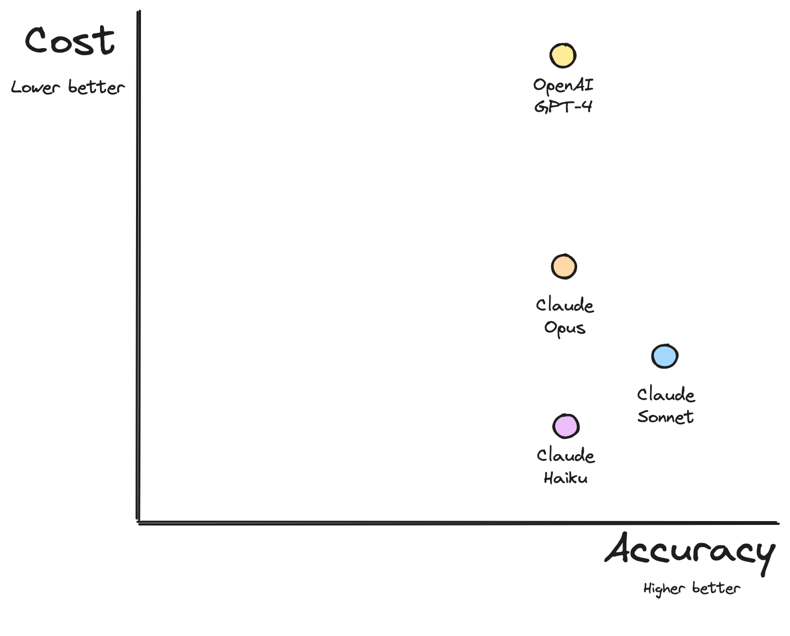
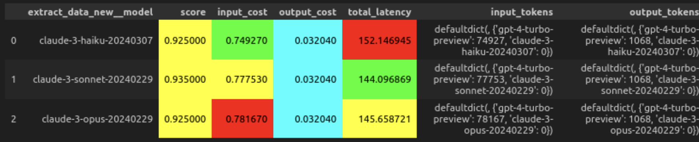
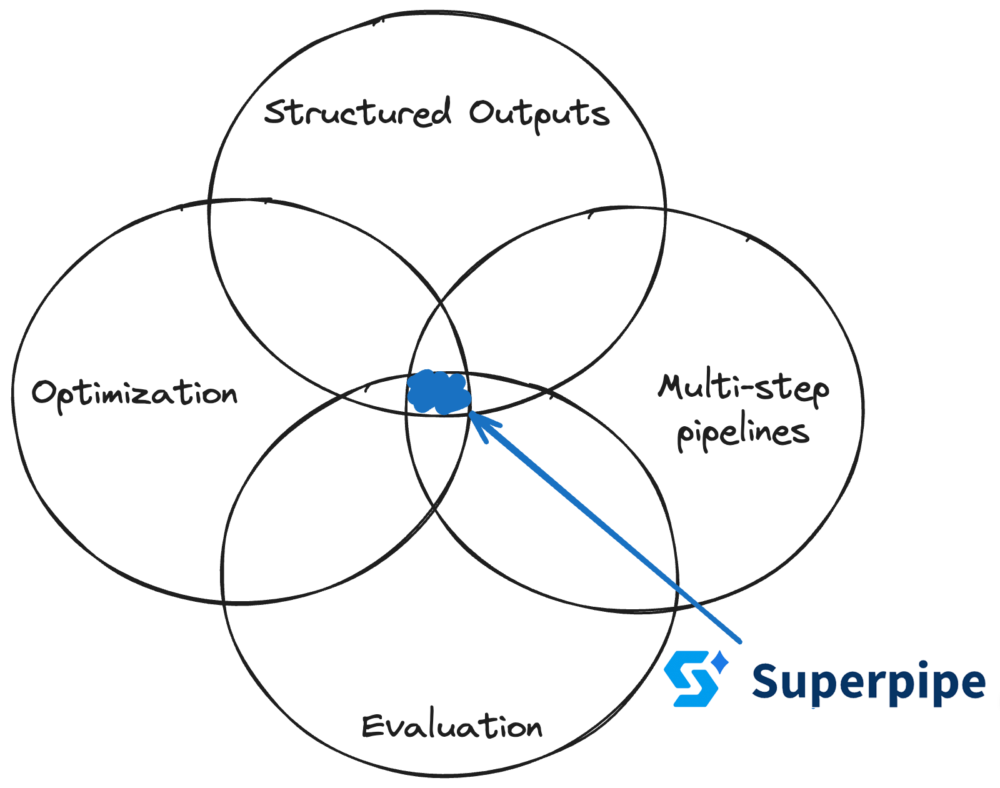

# Structured Data Extraction with Long Context: Comparing GPT-4 with Claude 3 Variants

By [Connor Casey](https://twitter.com/_connor_casey)

_Superipe is a lightweight framework to build, evaluate and optimize LLM pipelines for structured outputs: data labeling, extraction, classification, and tagging. Evaluate pipelines on your own data and optimize models, prompts and other parameters for the best accuracy, cost, and speed._

---

As large language models (LLMs) continue to push the boundaries of natural language processing (NLP), their ability to handle complex tasks such as structured data extraction with long context becomes increasingly important. In this article, we explore the performance of OpenAI’s GPT-4 and three variants of  Anthropic’s Claude 3 (Haiku, Sonnet, and Opus) in tackling such challenges using Superpipe.

## The Need for Structured Data Extraction

In today's data-driven world, organizations often grapple with the task of extracting structured information from unstructured or semi-structured sources. Whether it's classifying products, extracting key details from legal documents, or identifying named entities in long-form text, the ability to accurately and efficiently derive structured data is crucial for various applications, including data analysis, decision-making, and automation. Enterprises and SMBs alike need to ensure that their data extraction processes are reliable, scalable, and capable of handling the unique complexities and nuances of their own data. While benchmarks provide insights into the general performance of LLMs like GPT-4 and Claude 3, they often don’t translate to real-world performance, as each organization's data has its own idiosyncrasies, domain-specific terminology, and contextual intricacies.

## The Challenge of Long Context

While LLMs have demonstrated remarkable capabilities in natural language understanding and generation, their performance can be hindered when dealing with long, complex input texts. Long-context scenarios, where the relevant information is dispersed across extensive passages, pose a significant challenge for these models, as they must maintain coherence and accurately capture the nuances of the data. Additionally, as the length and complexity of the input increase, the computational demands on the model also rise, leading to higher latency and increased costs. These factors become increasingly important considerations for organizations looking to deploy LLMs for structured data extraction from lengthy sources. Striking the right balance between model performance, input size, and resource constraints is essential to ensure efficient and cost-effective operation.

## A Case Study: Comparing GPT-4 and Claude 3 (Opus, Sonnet, Haiku)

In our experiment, we used Superpipe to evaluate the performance of GPT-4, Claude 3 Haiku, Claude 3 Sonnet, and Claude 3 Opus in a structured data extraction task involving long-context text. We assumed the following three-step process for the design of the study.

A breakdown of these steps is outlined below:

## Step 1: Building the Pipeline

We first implemented a multi-step pipeline that was designed to receive a famous person's name and extract their birthday, living status, and cause of death (if applicable) from their Wikipedia page.

The pipeline comprises the following steps:

1. **Search Step:** Perform a Google search with the person's name.
1. **Parse Search Step:** Use an LLM to fetch the URL of the person's Wikipedia page from the search results.
1. **Fetch Wikipedia Step:** Fetch the contents of the Wikipedia page and convert them to Markdown format.
1. **Extract Data Step:** Use an LLM to extract the birthdate, living status, and cause of death (if applicable) from the Wikipedia content.

## Step 2: Evaluating the Pipeline

To evaluate the pipeline's performance, we had the following two components:

1. **Dataset with Labels:** A dataset containing a list of fifty famous famous personalities, along with their corresponding ground truth information – date of birth, living status (alive or deceased), and cause of death (if applicable). 
1. **Evaluation Function:** A function that defines the criteria for a "correct" output. This involves simple comparisons for the date of birth and living status, and an LLM call to evaluate the correctness of the cause of death.

## Step 3: Optimizing the Pipeline

After building and evaluating the initial pipeline, we focused on optimizing its performance by exploring different LLM configurations. The optimization process follows these steps:

1. **Analyze Performance and Cost:** Examine the cost and latency of each pipeline step to identify potential bottlenecks.
1. **Model Selection:** Implement the pipeline with three different variants of Claude 3 which may offer better performance or cost-efficiency compared to the initial model (GPT-4).
1. **Grid Search:** Perform a grid search across the different LLM options, evaluating the trade-offs between accuracy, cost, and latency.
1. **Select Best Configuration:** Choose the best-performing configuration based on the grid search results, considering factors like accuracy, cost, and latency.
1. **Run Optimized Pipeline:** Execute the optimized pipeline with the selected configuration and report the final performance metrics.

## Results and Analysis

In analyzing the results, the GPT-4 model, with a context window of 128,000 tokens, demonstrates an accuracy level of 92.5%. However, this performance comes at a significant financial and operational cost. Combine this with the highest latency, GPT-4 has immense capabilities, though this specific task does not reward them for this specific task.

Contrastingly, the Claude 3 models, including Haiku and Opus, offer a more nuanced balance between cost-efficiency and accuracy. With a context window of 200,000 tokens, these models not only match GPT-4's accuracy but also dramatically lower operational cost. While Opus is Anthropic's most capable model and considered the most comparable to GPT-4 in terms of capabilities, this experiment again does not reward these capabilities.
Claude Sonnet stands out in this task by surpassing the accuracy of the other models and reaching a 93.5% accuracy rate. This increment in precision does not compromise its cost-efficiency, maintaining an input cost that ⅓ that of GPT-4 and ⅕ that of Opus from an input token perspective. Moreover, it boasts the shortest latency period among the models reviewed, underscoring its exceptional value for applications demanding both high accuracy and quick processing.
While GPT-4 delivers high accuracy, its prohibitive costs and latency make it less suitable for applications with budgetary constraints or demanding swift outputs. In contrast, the Claude models, particularly Sonnet, emerge as highly effective alternatives, offering competitive accuracy at significantly lower costs and minimal latency, striking an ideal balance between performance and operational efficiency. Notably, this experiment highlights the importance of task-specific model evaluation, as smaller, cheaper models can sometimes outperform larger ones, defying expectations from public benchmarks. Ultimately, testing models on one's own data remains crucial for identifying the best fit for unique requirements.

## Conclusion

This article highlighted the performances of OpenAI's GPT-4 and Anthropic's Claude 3 variants (Haiku, Sonnet, and Opus) in structured data extraction tasks. Notably, while GPT-4 showcases impressive accuracy, it is encumbered by high costs and latency, suggesting its suitability may be limited to scenarios where budget and time are less constrained. Conversely, the Claude 3 variants, especially Sonnet, emerge as potent alternatives, offering an exceptional blend of high accuracy, cost-efficiency, and low latency. This case study underscores the vital importance of context-specific model selection, challenging prevailing assumptions about the superiority of larger models based on general benchmarks. As enterprises and SMBs navigate the complexities of data extraction for their unique needs, Superpipe emerges as the pivotal tool to build, evaluate and optimize LLM pipelines for structured outputs.

As the field of NLP continues to evolve, we anticipate further advancements in LLM capabilities, architectures, and training methodologies. By leveraging tools like Superpipe organizations can harness the power of LLMs to unlock valuable insights from their data, driving innovation and gaining a competitive edge.

## Learn more

The best way to learn more about Superpipe by reading our [docs](https://superpipe.ai), checking out our [Github](https://github.com/villagecomputing/superpipe), or asking questions on our [Discord](https://discord.gg/paV2qcHmH7).
